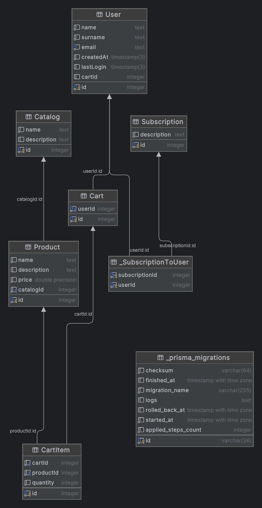

# Furniture-website:
  Батманов Артём Юрьевич, М3311, сайт интернет-магазин дизайнерской мебели и аксессуаров

# Описание:
  Cайт интернет-магазин с каталогом товаров и чек листом для покупок.
  Товары находятся в каталоге, их пока нет.

# Ссылка на дизайн сайта:
  https://www.figma.com/design/XQ0ZbhLJYnMMlZhkjtqbFK/Untitled?node-id=0-1&t=WGTqyGBU4E8jN28g-1

# Ссылка на сайт:
  https://m3311-batmanov.onrender.com

# Схема БД:
  
  Описание:

  User : Пользователь системы (имя, email, корзина, подписки).
  Catalog : Каталог товаров (название, описание, список товаров).
  Product : Товар (название, цена, принадлежность к каталогу).
  Subscription : Рассылка (описание, подписчики).
  Cart : Корзина пользователя (список товаров).
  CartItem : Элемент корзины (товар + количество).